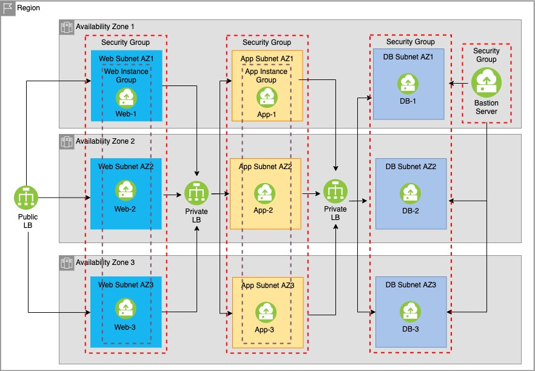

# Overview
This 3-tier application use cases incorporates a compute feature, autoscale for the first and second tier VSIs.
Autoscale helps the VSI to scale horizontally (up or down) based on VSIs' resources demands.

## Requirements

| Name | Version |
|------|---------|
|  [terraform](#requirement\_terraform) | >= 0.13.0 |
|  [ibm](#requirement\_ibm) | 1.26.0 |

## Providers

| Name | Version |
|------|---------|
|  [ibm](#provider\_ibm) | 1.26.0 |

## Modules

| Name | Source | Version |
|------|--------|---------|
|  [bastion](#module\_bastion) | ./modules/bastion |  |
|  [instance](#module\_instance) | ./modules/instance |  |
|  [instance\_group](#module\_instance\_group) | ./modules/instance_groups |  |
|  [load\_balancer](#module\_load\_balancer) | ./modules/load_balancers |  |
|  [security\_group](#module\_security\_group) | ./modules/security_groups |  |
|  [subnet](#module\_subnet) | ./modules/subnets |  |

## Resources

| Name | Type |
|------|------|
| [ibm_is_vpc.vpc](https://registry.terraform.io/providers/IBM-Cloud/ibm/1.26.0/docs/resources/is_vpc) | resource |
| [ibm_is_ssh_key.ssh_key_id](https://registry.terraform.io/providers/IBM-Cloud/ibm/1.26.0/docs/data-sources/is_ssh_key) | data source |

## Inputs

| Name | Description | Type | Default | Required |
|------|-------------|------|---------|:--------:|
|  [alb\_port](#input\_alb\_port) | This is the Application load balancer listener port | `number` | `"80"` | no |
|  [api\_key](#input\_api\_key) | Please enter the IBM Cloud API key. | `string` | n/a | yes |
|  [app\_config](#input\_app\_config) | Application Configurations to be passed for App Instance Group creation | `map(any)` | <pre>{   "application_port": "80",   "instance_image": "r006-78fafd7c-4fc6-4373-a58a-637ba6dc3ee8",   "instance_profile": "cx2-2x4",   "memory_percent": "40",   "network_in": "40",   "network_out": "40" }</pre> | no |
|  [app\_cpu\_percent](#input\_app\_cpu\_percent) | Average target CPU Percent for CPU policy of App Instance Group | `number` | n/a | yes |
|  [app\_max\_servers\_count](#input\_app\_max\_servers\_count) | Maximum App servers count for the App Instance group | `number` | n/a | yes |
|  [app\_min\_servers\_count](#input\_app\_min\_servers\_count) | Minimum App servers count for the App Instance group | `number` | n/a | yes |
|  [bandwidth](#input\_bandwidth) | Bandwidth per second in GB. The possible values are 3, 5 and 10 | `number` | n/a | yes |
|  [bastion\_profile](#input\_bastion\_profile) | Specify the profile needed for Bastion VSI | `string` | `"cx2-2x4"` | no |
|  [bastion\_ssh\_key\_var\_name](#input\_bastion\_ssh\_key\_var\_name) | This is the name of the ssh key which will be generated dynamically on the bastion server and further will be attached with all the other Web/App/DB servers. It will be used to login to Web/App/DB servers via Bastion server only. | `string` | `"bastion-ssh-key"` | no |
|  [db\_image](#input\_db\_image) | Custom image id for the Database VSI | `string` | `"r006-78fafd7c-4fc6-4373-a58a-637ba6dc3ee8"` | no |
|  [db\_profile](#input\_db\_profile) | Hardware configuration profile for the Database VSI. | `string` | `"cx2-2x4"` | no |
|  [dlb\_port](#input\_dlb\_port) | This is the DB load balancer listener port | `number` | `"80"` | no |
|  [ip\_count](#input\_ip\_count) | Enter total number of IP Address for each subnet | `number` | `32` | no |
|  [prefix](#input\_prefix) | This is the prefix text that will be prepended in every resource name created by this script. | `string` | n/a | yes |
|  [region](#input\_region) | Please enter a region from the following available region and zones mapping:  us-south us-east eu-gb eu-de jp-tok au-syd | `string` | n/a | yes |
|  [resource\_group\_id](#input\_resource\_group\_id) | Resource Group ID | `string` | n/a | yes |
|  [size](#input\_size) | Storage size in GB. The value should be between 10 and 2000 | `number` | `"10"` | no |
|  [total\_instance](#input\_total\_instance) | Total instances that will be created per zones per tier. | `number` | `1` | no |
|  [user\_ip\_address](#input\_user\_ip\_address) | Provide the User's Public IP address in the format X.X.X.X which will be used to login to Bastion VSI. Also Please update your changed public IP address everytime before executing terraform apply | `string` | n/a | yes |
|  [user\_ssh\_key](#input\_user\_ssh\_key) | This is the existing ssh key on the User's machine and will be attached with the bastion server only. This will ensure the incoming connection on Bastion Server only from the users provided ssh\_keys. You can check your key name in IBM cloud. Whose private key content should be there in path ~/.ssh/id\_rsa | `string` | n/a | yes |
|  [web\_config](#input\_web\_config) | Web Configurations to be passed for Web Instance Group creation | `map(any)` | <pre>{   "application_port": "80",   "instance_image": "r006-78fafd7c-4fc6-4373-a58a-637ba6dc3ee8",   "instance_profile": "cx2-2x4",   "memory_percent": "40",   "network_in": "40",   "network_out": "40" }</pre> | no |
|  [web\_cpu\_percent](#input\_web\_cpu\_percent) | Average target CPU Percent for CPU policy of Web Instance Group | `number` | n/a | yes |
|  [web\_max\_servers\_count](#input\_web\_max\_servers\_count) | Maximum Web servers count for the Web Instance group | `number` | n/a | yes |
|  [web\_min\_servers\_count](#input\_web\_min\_servers\_count) | Minimum Web servers count for the Web Instance group | `number` | n/a | yes |
|  [zones](#input\_zones) | Region and zones mapping | `map(any)` | <pre>{   "au-syd": [     "au-syd-1",     "au-syd-2",     "au-syd-3"   ],   "eu-de": [     "eu-de-1",     "eu-de-2",     "eu-de-3"   ],   "eu-gb": [     "eu-gb-1",     "eu-gb-2",     "eu-gb-3"   ],   "jp-tok": [     "jp-tok-1",     "jp-tok-2",     "jp-tok-3"   ],   "us-east": [     "us-east-1",     "us-east-2",     "us-east-3"   ],   "us-south": [     "us-south-1",     "us-south-2",     "us-south-3"   ] }</pre> | no |

## Outputs

| Name | Description |
|------|-------------|
|  [LOAD\_BALANCER](#output\_LOAD\_BALANCER) | This variable will display the private and public IP addresses and DNS of load balancers |
|  [VSI](#output\_VSI) | This variable will display the private IP address of DB servers and the public IP address of Bastion Server |
