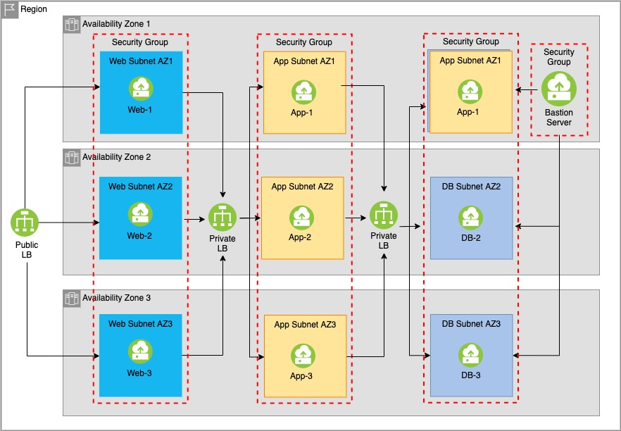

# Overview
This use case builds the following in a single MZR.  A single VSI is created across 3 diffferent zones
and for each tier, totally 9 VSIs, and in their respective subnets and security groups. In addition,
another VSI, bastion server, is created for VSIs access and management.  Load balancers are created for
each tier to help distribute incoming requests.

**Note: You change the VSI count to increase the number of total VSIs for the application which also may
mean increasing the subnet count. Pluse you will also need to modify the security groups and load balancers
policies to match your application requirements.

* Resource Count for this project:
* VPC Count             = 1
* Subnet Count          = 10
* Security Group Count  = 3
* Security Group Rule   = 5
* Load Balancers        = 3

## Requirements

| Name | Version |
|------|---------|
|  [terraform](#requirement\_terraform) | >= 0.12 |
|  [ibm](#requirement\_ibm) | >= 1.26.0 |

## Providers

| Name | Version |
|------|---------|
|  [ibm](#provider\_ibm) | >= 1.26.0 |

## Modules

| Name | Source | Version |
|------|--------|---------|
|  [instance](#module\_instance) | ./modules/instances |  |
|  [load\_balancer](#module\_load\_balancer) | ./modules/load_balancers |  |
|  [security\_group](#module\_security\_group) | ./modules/security_groups |  |
|  [subnet](#module\_subnet) | ./modules/subnets |  |

## Resources

| Name | Type |
|------|------|
| [ibm_is_vpc.vpc](https://registry.terraform.io/providers/IBM-Cloud/ibm/latest/docs/resources/is_vpc) | resource |
| [ibm_is_ssh_key.ssh_key_id](https://registry.terraform.io/providers/IBM-Cloud/ibm/latest/docs/data-sources/is_ssh_key) | data source |

## Inputs

| Name | Description | Type | Default | Required |
|------|-------------|------|---------|:--------:|
|  [api\_key](#input\_api\_key) | Please enter the IBM Cloud API key. | `string` | n/a | yes |
|  [ip\_count](#input\_ip\_count) | Enter total number of IP Address for each subnet | `any` | `32` | no |
|  [prefix](#input\_prefix) | This is the prefix text that will be prepended in every resource name created by this script. | `string` | n/a | yes |
|  [region](#input\_region) | Please enter a region from the following available region and zones mapping:  us-south us-east eu-gb eu-de jp-tok au-syd | `string` | n/a | yes |
|  [resource\_group](#input\_resource\_group) | Resource Group: | `string` | n/a | yes |
|  [ssh\_key](#input\_ssh\_key) | Enter your IBM cloud ssh key name. | `string` | n/a | yes |
|  [total\_instance](#input\_total\_instance) | Total instances that will be created per zones per tier. | `number` | `1` | no |
|  [zones](#input\_zones) | Region and zones mapping | `map(any)` | <pre>{   "au-syd": [     "au-syd-1",     "au-syd-2",     "au-syd-3"   ],   "eu-de": [     "eu-de-1",     "eu-de-2",     "eu-de-3"   ],   "eu-gb": [     "eu-gb-1",     "eu-gb-2",     "eu-gb-3"   ],   "jp-tok": [     "jp-tok-1",     "jp-tok-2",     "jp-tok-3"   ],   "us-east": [     "us-east-1",     "us-east-2",     "us-east-3"   ],   "us-south": [     "us-south-1",     "us-south-2",     "us-south-3"   ] }</pre> | no |

## Outputs

| Name | Description |
|------|-------------|
|  [lb-app-dns](#output\_lb-app-dns) | n/a |
|  [lb-app-ip](#output\_lb-app-ip) | n/a |
|  [lb-db-dns](#output\_lb-db-dns) | n/a |
|  [lb-db-ip](#output\_lb-db-ip) | n/a |
|  [lb-web-dns](#output\_lb-web-dns) | n/a |
|  [lb-web-ip](#output\_lb-web-ip) | n/a |
|  [vsi-app-ips](#output\_vsi-app-ips) | n/a |
|  [vsi-bastion-ip](#output\_vsi-bastion-ip) | n/a |
|  [vsi-db-ips](#output\_vsi-db-ips) | n/a |
|  [vsi-web-ips](#output\_vsi-web-ips) | n/a |
