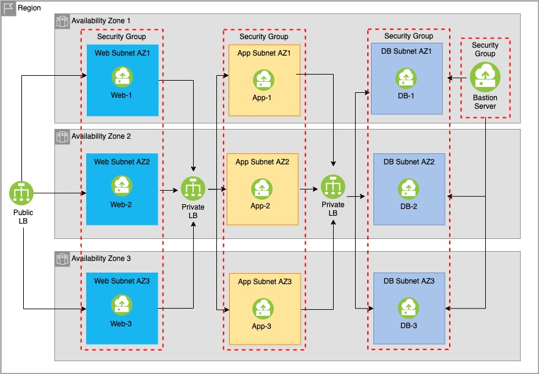
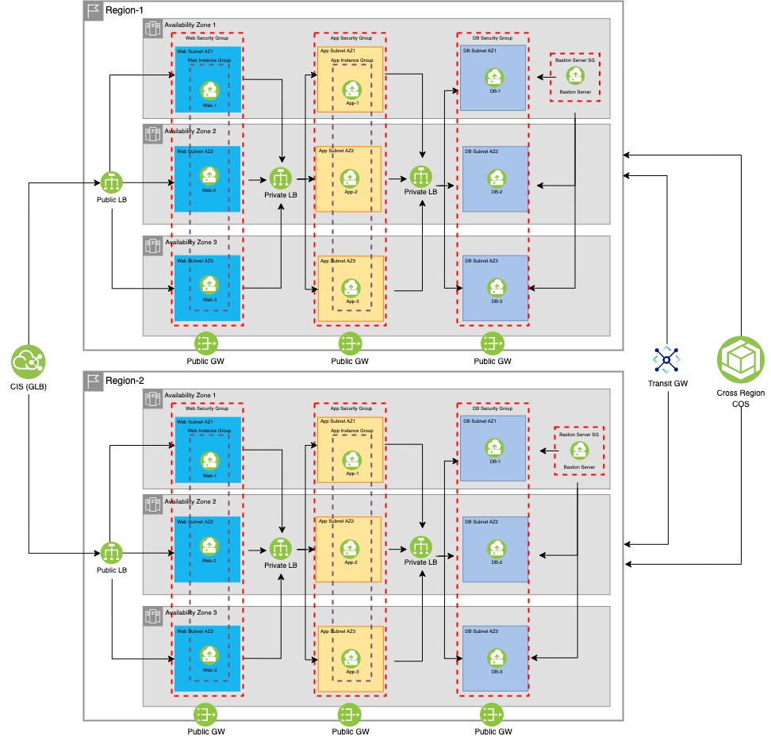

# Overview
The goal of this repository is to provide various samples of infrastructure as code (IAC) in the
form of terraform scripts for setting up resilient infrastructure on IBM Cloud VPC. The terraform
scripts provide an automated way for developers, DevOps, or system administrators to set up a
resilient 3-tier application with Intel Xeon processors on IBM Cloud Virtual Private Cloud (VPC).
While there is no one size fit, the intent is to provide example codes for different use cases that
can be used either as a education tool or framework to build the resilient infrastructure. It is
expected that you will need to modify the code to adapt to your business or application requirements.

Pre-Requisite:
- IBM Cloud account
- API Key
- Knowledgeable with IBM Cloud VPC
- Knowledgeable with Terraform
- Machine with Terraform package

Does NOT:
- Install software packages
- Setup replication on the db
- Create snapshots
 
## Use 1: 3 Tier application (stateless)

Setting up a resilient infrastructure for a 3-tier application (web, app, and db) in a single MZR.
Each tier will span across the 3 different availability zones.  Every tier, the VSIs are created
across the different availability zones to protect against a single point of failure against
component and availability zone.

In addition, the following are created:
- All VSIs are private only and should be linux
- Application load balancer for all 3 tiers to distribute traffic to healthy VSIs.
- Security groups to limit communication within a tier and with adjacent tier
- Bastion server with public interface and should be linux

## Use 2: 3 Tier application with autoscale
Use Case 2 builds off of Use Case 1 and includes a compute feature, autoscale, for a single MZR.
Autoscale provides horizontal scaling of VSIs based on the current load.  You set up a scaling
policy that defines the minimum and maximum range for the number of VSIs.  You add and pay for
what you need, and delete and save when the load demand is lower.  Autoscale is set up for the
web and app tier.

Note: It is recommended to build a golden image that autoscale can fork from.  Otherwise, when
using the base image, user-data or post-install scripts are required to build the VSI.

## Use 3: Multi-region

For multi-region, it takes the Use Case 2 and replicates the same infrastructure setup for a
2nd MZR for active-active.  Resiliency is typically within an MZR, but the second region does
provide protection against region failure. 

Additional elements are added for multi-region
- Transit gateway for cross-region communication/management
- Cross-region COS
- Cloud Internet Services (CIS)/global load balancer
- Subnet gateway

# Suggestion/Issues
While there are no warranties of any kind, and there is no service or technical support available
for these scripts from IBM support, your comments are welcomed by the maintainers and developers,
who reserve the right to revise or remove the tools at any time. We, maintainers and developers,
will support the scripts posted in this repository. To report problems, provide suggestions or
comments, please open a GitHub issue. If the scripts are modified and have issues, we will do our
best to assist.
