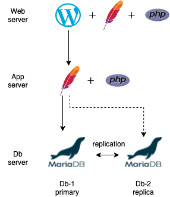

## Overview
This builds on top of [multi-MZR](../multi-region/README.md) as described. The resources and infrastructure does not change.
The add-on is the software packages deployed with the VSIs in their respective tier.
- Web Tier: WordPress, Apache, and PHP
- App Tier: Apache and PHP
- DB Tier: MariaDB

**Note:** Replication between dbs is a post-install and needs to be configured by the db software.

Software packages can be modified or changed to another of choice.  You will need to alter the userdata in the following location:
| VSI | Location |
| --- | -------- |
| Web | ./modules/instance_group/web_ig.tf |
| App | ./modules/instance_group/app_ig.tf |
| DB | ./modules/instance/db.tf |

## Requirements

| Name | Version |
|------|---------|
|  [terraform](#requirement\_terraform) | >= 0.14.0 |
|  [ibm](#requirement\_ibm) | 1.45.0 |

## Providers

| Name | Version |
|------|---------|
|  [ibm.jp-osa](#provider\_ibm.jp-osa) | 1.45.0 |
|  [ibm.jp-tok](#provider\_ibm.jp-tok) | 1.45.0 |

## Modules

| Name | Source | Version |
|------|--------|---------|
|  [bastion\_region1](#module\_bastion\_region1) | ./modules/bastion | n/a |
|  [bastion\_region2](#module\_bastion\_region2) | ./modules/bastion | n/a |
|  [instance\_group\_region1](#module\_instance\_group\_region1) | ./modules/instance_group | n/a |
|  [instance\_group\_region2](#module\_instance\_group\_region2) | ./modules/instance_group | n/a |
|  [instance\_region1](#module\_instance\_region1) | ./modules/instance | n/a |
|  [instance\_region2](#module\_instance\_region2) | ./modules/instance | n/a |
|  [load\_balancer\_region1](#module\_load\_balancer\_region1) | ./modules/load_balancer | n/a |
|  [load\_balancer\_region2](#module\_load\_balancer\_region2) | ./modules/load_balancer | n/a |
|  [pg\_region1](#module\_pg\_region1) | ./modules/public_gateway | n/a |
|  [pg\_region2](#module\_pg\_region2) | ./modules/public_gateway | n/a |
|  [sg\_region1](#module\_sg\_region1) | ./modules/security_group | n/a |
|  [sg\_region2](#module\_sg\_region2) | ./modules/security_group | n/a |
|  [ssh\_key\_data\_sources\_region1](#module\_ssh\_key\_data\_sources\_region1) | ./modules/ssh_key | n/a |
|  [ssh\_key\_data\_sources\_region2](#module\_ssh\_key\_data\_sources\_region2) | ./modules/ssh_key | n/a |
|  [subnet\_region1](#module\_subnet\_region1) | ./modules/subnet | n/a |
|  [subnet\_region2](#module\_subnet\_region2) | ./modules/subnet | n/a |
|  [transit\_gateway](#module\_transit\_gateway) | ./modules/transit_gateway | n/a |
|  [vpc\_region1](#module\_vpc\_region1) | ./modules/vpc | n/a |
|  [vpc\_region2](#module\_vpc\_region2) | ./modules/vpc | n/a |

## Resources

| Name | Type |
|------|------|
| [ibm_is_ssh_key.ssh_key_id_region1](https://registry.terraform.io/providers/IBM-Cloud/ibm/1.45.0/docs/data-sources/is_ssh_key) | data source |
| [ibm_is_ssh_key.ssh_key_id_region2](https://registry.terraform.io/providers/IBM-Cloud/ibm/1.45.0/docs/data-sources/is_ssh_key) | data source |

## Inputs

| Name | Description | Type | Default | Required |
|------|-------------|------|---------|:--------:|
|  [alb\_port](#input\_alb\_port) | This is the Application load balancer listener port | `number` | `80` | no |
|  [allow\_insecure](#input\_allow\_insecure) | If set to true, the certificate is not validated when the health check uses HTTPS. If set to false, the certificate is validated, even if the health check uses HTTPS. The default value is false. | `bool` | `"false"` | no |
|  [api\_key](#input\_api\_key) | Please enter the IBM Cloud API key. | `string` | n/a | yes |
|  [app\_aggregation\_window](#input\_app\_aggregation\_window) | The aggregation window is the time period in seconds that the instance group manager monitors each instance and determines the average utilization. | `number` | `90` | no |
|  [app\_config](#input\_app\_config) | Application Configurations to be passed for App Instance Group creation | `map(any)` | <pre>{   "application_port": "80",   "instance_profile": "cx2-2x4",   "memory_percent": "70",   "network_in": "4000",   "network_out": "4000" }</pre> | no |
|  [app\_cooldown\_time](#input\_app\_cooldown\_time) | Specify the cool down period, the number of seconds to pause further scaling actions after scaling has taken place. | `number` | `120` | no |
|  [app\_cpu\_threshold](#input\_app\_cpu\_threshold) | Average target CPU Percent for CPU policy of App Instance Group | `number` | n/a | yes |
|  [app\_image\_region1](#input\_app\_image\_region1) | Custom image id for the app VSI | `string` | n/a | yes |
|  [app\_image\_region2](#input\_app\_image\_region2) | Custom image id for the app VSI | `string` | n/a | yes |
|  [app\_max\_servers\_count](#input\_app\_max\_servers\_count) | Maximum App servers count for the App Instance group | `number` | n/a | yes |
|  [app\_min\_servers\_count](#input\_app\_min\_servers\_count) | Minimum App servers count for the App Instance group | `number` | n/a | yes |
|  [app\_os\_type](#input\_app\_os\_type) | OS image to be used Linux for App Server. This OS type should be same across both the regions. | `string` | n/a | yes |
|  [bandwidth](#input\_bandwidth) | Bandwidth per second in GB. The possible values are 3, 5 and 10 | `number` | n/a | yes |
|  [bastion\_image\_region1](#input\_bastion\_image\_region1) | Custom image id for the Bastion VSI Region-1 | `string` | n/a | yes |
|  [bastion\_image\_region2](#input\_bastion\_image\_region2) | Custom image id for the Bastion VSI Region-2 | `string` | n/a | yes |
|  [bastion\_ip\_count](#input\_bastion\_ip\_count) | IP count is the total number of total\_ipv4\_address\_count for Bastion Subnet | `number` | `8` | no |
|  [bastion\_os\_type](#input\_bastion\_os\_type) | OS image to be used linux for Bastion server. This OS type should be same across both the regions. | `string` | n/a | yes |
|  [bastion\_profile](#input\_bastion\_profile) | Specify the profile needed for Bastion VSI | `string` | `"cx2-2x4"` | no |
|  [bucket\_location](#input\_bucket\_location) | The location of the COS bucket | `string` | n/a | yes |
|  [cis\_glb\_location](#input\_cis\_glb\_location) | Location to be used for CIS instance for GLB | `string` | `"global"` | no |
|  [cis\_glb\_plan](#input\_cis\_glb\_plan) | Plan to be used for CIS instance for GLB | `string` | `"standard"` | no |
|  [cos\_bucket\_plan](#input\_cos\_bucket\_plan) | Please enter plan name for COS bucket. Possible value is  1:lite 2:standard | `string` | n/a | yes |
|  [cross\_region\_location](#input\_cross\_region\_location) | Cross Region service provides higher durability and availability than using a single region, at the cost of slightly higher latency. This service is available today in the U.S., E.U., and A.P. areas. | `string` | n/a | yes |
|  [data\_vol\_size](#input\_data\_vol\_size) | Storage size in GB. The value should be between 10 and 2000 | `number` | `10` | no |
|  [db\_image\_region1](#input\_db\_image\_region1) | Custom image id for the Database VSI from Region-1 | `string` | n/a | yes |
|  [db\_image\_region2](#input\_db\_image\_region2) | Custom image id for the Database VSI from Region-2 | `string` | n/a | yes |
|  [db\_name](#input\_db\_name) | Database will be created with the specified name | `string` | n/a | yes |
|  [db\_os\_type](#input\_db\_os\_type) | OS image to be used linux for DB server. This OS type should be same across both the regions. | `string` | n/a | yes |
|  [db\_profile](#input\_db\_profile) | Hardware configuration profile for the Database VSI. | `string` | `"cx2-2x4"` | no |
|  [db\_pwd](#input\_db\_pwd) | Database user will be created with the specified password | `string` | n/a | yes |
|  [db\_user](#input\_db\_user) | Database user will be created with the specified name | `string` | n/a | yes |
|  [db\_vsi\_count](#input\_db\_vsi\_count) | Total Database instances that will be created in the user specified region. | `number` | `2` | no |
|  [enable\_floating\_ip](#input\_enable\_floating\_ip) | Determines whether to enable floating IP for Bastion server or not. Give true or false. | `bool` | n/a | yes |
|  [expected\_body](#input\_expected\_body) | A case-insensitive sub-string to look for in the response body. If this string is not found, the origin will be marked as unhealthy. A null value of “” is allowed to match on any content | `string` | `""` | no |
|  [expected\_codes](#input\_expected\_codes) | The expected HTTP response code or code range of the health check | `string` | `"2xx"` | no |
|  [follow\_redirects](#input\_follow\_redirects) | If set to true, a redirect is followed when a redirect is returned by the origin pool. Is set to false, redirects from the origin pool are not followed | `bool` | `"true"` | no |
|  [glb\_domain\_name](#input\_glb\_domain\_name) | Domain name to be used with global load balancer | `string` | n/a | yes |
|  [glb\_healthcheck\_method](#input\_glb\_healthcheck\_method) | Method to be used for GLB health check | `string` | `"GET"` | no |
|  [glb\_healthcheck\_path](#input\_glb\_healthcheck\_path) | The endpoint path to health check against | `string` | `"/"` | no |
|  [glb\_healthcheck\_port](#input\_glb\_healthcheck\_port) | The TCP port number that you want to use for the health check. | `number` | `80` | no |
|  [glb\_healthcheck\_timeout](#input\_glb\_healthcheck\_timeout) | The timeout in seconds before marking the health check as failed | `number` | `7` | no |
|  [glb\_protocol\_type](#input\_glb\_protocol\_type) | The protocol to use for the health check | `string` | `"http"` | no |
|  [glb\_proxy\_enabled](#input\_glb\_proxy\_enabled) | Global loadbalancer proxy state | `string` | `"true"` | no |
|  [glb\_region1\_code](#input\_glb\_region1\_code) | Enter the Region code for GLB Geo Routing for Region 1 Pool:  Region Code -> Region Name  EEU -> Eastern Europe  ENAM -> Eastern North America  ME -> Middle East  NAF -> Northern Africa  NEAS -> Northeast Asia  NSAM -> Northern South America  OC -> Oceania  SAF -> Southern Africa  SAS -> Southern Asia  SEAS -> Southeast Asia  SSAM -> Southern South America  WEU -> Western Europe  WNAM -> Western North America | `string` | n/a | yes |
|  [glb\_region2\_code](#input\_glb\_region2\_code) | Enter the Region code for GLB Geo Routing for Region 2 Pool:  Region Code -> Region Name  EEU -> Eastern Europe  ENAM -> Eastern North America  ME -> Middle East  NAF -> Northern Africa  NEAS -> Northeast Asia  NSAM -> Northern South America  OC -> Oceania  SAF -> Southern Africa  SAS -> Southern Asia  SEAS -> Southeast Asia  SSAM -> Southern South America  WEU -> Western Europe  WNAM -> Western North America | `string` | n/a | yes |
|  [glb\_traffic\_steering](#input\_glb\_traffic\_steering) | GLB traffic Steering Policy which allows off,geo,random,dynamic\_latency | `string` | n/a | yes |
|  [interval](#input\_interval) | The interval between each health check. Shorter intervals may improve failover time, but will increase load on the origins as we check from multiple locations | `number` | `60` | no |
|  [lb\_algo](#input\_lb\_algo) | lbaaS backend distribution algorithm | `map(any)` | <pre>{   "least-x": "least_connections",   "rr": "round_robin",   "wrr": "weighted_round_robin" }</pre> | no |
|  [lb\_port\_number](#input\_lb\_port\_number) | declare lbaaS pool member port number | `map(any)` | <pre>{   "custom": "xxx",   "http": "80",   "https": "443" }</pre> | no |
|  [lb\_protocol](#input\_lb\_protocol) | lbaaS protocols | `map(any)` | <pre>{   "443": "https",   "80": "http",   "l4-tcp": "tcp" }</pre> | no |
|  [lb\_type\_private](#input\_lb\_type\_private) | This variable will hold the Load Balancer type as private | `string` | `"private"` | no |
|  [lb\_type\_public](#input\_lb\_type\_public) | This variable will hold the Load Balancer type as public | `string` | `"public"` | no |
|  [local\_machine\_os\_type](#input\_local\_machine\_os\_type) | Operating System to be used [windows \| mac \| linux] for your local machine which is running terraform apply | `string` | n/a | yes |
|  [minimum\_origins](#input\_minimum\_origins) | The minimum number of origins that must be healthy for the pool to serve traffic. If the number of healthy origins falls within this number, the pool will be marked unhealthy and we will failover to the next available pool | `number` | `1` | no |
|  [notification\_email](#input\_notification\_email) | The Email address to send health status notifications to. This can be an individual mailbox or a mailing list. | `string` | n/a | yes |
|  [obj\_content](#input\_obj\_content) | Literal string value to use as an object content, which will be uploaded as UTF-8 encoded text. Conflicts with content\_base64 and content\_file | `string` | n/a | yes |
|  [obj\_key](#input\_obj\_key) | The name of an object in the COS bucket. This is used to identify our object. | `string` | n/a | yes |
|  [prefix](#input\_prefix) | This is the prefix text that will be prepended in every resource name created by this script. | `string` | n/a | yes |
|  [public\_ip\_addresses](#input\_public\_ip\_addresses) | Provide the list of User's Public IP addresses in the format "X.X.X.X" which will be used to login to Bastion VSI. For example: "123.201.8.30,219.91.139.49".  Also Please provide the updated list of public IP addresses everytime before executing. | `string` | n/a | yes |
|  [region1\_pool\_weight](#input\_region1\_pool\_weight) | The origin pool-1 weight. | `number` | `1` | no |
|  [region2\_pool\_weight](#input\_region2\_pool\_weight) | The origin pool-2 weight. | `number` | `1` | no |
|  [resource\_group\_id](#input\_resource\_group\_id) | Resource Group ID | `string` | n/a | yes |
|  [retries](#input\_retries) | The number of retries to attempt in case of a timeout before marking the origin as unhealthy | `number` | `3` | no |
|  [storage\_class](#input\_storage\_class) | Storage class helps in choosing a right storage plan and location and helps in reducing the cost. | `string` | n/a | yes |
|  [tiered\_profiles](#input\_tiered\_profiles) | Tiered profiles for Input/Output per seconds in GBs | `map(any)` | <pre>{   "10": "10iops-tier",   "3": "general-purpose",   "5": "5iops-tier" }</pre> | no |
|  [user\_ssh\_keys](#input\_user\_ssh\_keys) | This is the list of existing ssh key/keys on the User's machine and will be attached with the bastion server only. For example: "first-ssh-key,second-ssh-key". This will ensure the incoming connection on Bastion Server only from the users provided ssh\_keys. You can check your key name in IBM cloud. | `string` | n/a | yes |
|  [web\_aggregation\_window](#input\_web\_aggregation\_window) | The aggregation window is the time period in seconds that the instance group manager monitors each instance and determines the average utilization. | `number` | `90` | no |
|  [web\_config](#input\_web\_config) | Web Configurations to be passed for Web Instance Group creation | `map(any)` | <pre>{   "application_port": "80",   "instance_profile": "cx2-2x4",   "memory_percent": "70",   "network_in": "4000",   "network_out": "4000" }</pre> | no |
|  [web\_cooldown\_time](#input\_web\_cooldown\_time) | Specify the cool down period, the number of seconds to pause further scaling actions after scaling has taken place. | `number` | `120` | no |
|  [web\_cpu\_threshold](#input\_web\_cpu\_threshold) | Average target CPU Percent for CPU policy of Web Instance Group | `number` | n/a | yes |
|  [web\_image\_region1](#input\_web\_image\_region1) | Custom image id for the web VSI from Region-1 | `string` | n/a | yes |
|  [web\_image\_region2](#input\_web\_image\_region2) | Custom image id for the web VSI from Region-2 | `string` | n/a | yes |
|  [web\_max\_servers\_count](#input\_web\_max\_servers\_count) | Maximum Web servers count for the Web Instance group | `number` | n/a | yes |
|  [web\_min\_servers\_count](#input\_web\_min\_servers\_count) | Minimum Web servers count for the Web Instance group | `number` | n/a | yes |
|  [web\_os\_type](#input\_web\_os\_type) | OS image to be used linux for Web server. This OS type should be same across both the regions. | `string` | n/a | yes |
|  [wp\_admin\_email](#input\_wp\_admin\_email) | Password of the Admin User for the wordpress website | `string` | n/a | yes |
|  [wp\_admin\_password](#input\_wp\_admin\_password) | Password of the Admin User for the wordpress website | `string` | n/a | yes |
|  [wp\_admin\_user](#input\_wp\_admin\_user) | Name of the Admin User of the wordpress website | `string` | n/a | yes |
|  [wp\_blog\_title](#input\_wp\_blog\_title) | Title of the website or blog | `string` | n/a | yes |
|  [zones](#input\_zones) | Region and zones mapping | `map(any)` | <pre>{   "au-syd": [     "au-syd-1",     "au-syd-2",     "au-syd-3"   ],   "br-sao": [     "br-sao-1",     "br-sao-2",     "br-sao-3"   ],   "ca-tor": [     "ca-tor-1",     "ca-tor-2",     "ca-tor-3"   ],   "eu-de": [     "eu-de-1",     "eu-de-2",     "eu-de-3"   ],   "eu-gb": [     "eu-gb-1",     "eu-gb-2",     "eu-gb-3"   ],   "jp-osa": [     "jp-osa-1",     "jp-osa-2",     "jp-osa-3"   ],   "jp-tok": [     "jp-tok-1",     "jp-tok-2",     "jp-tok-3"   ],   "us-east": [     "us-east-1",     "us-east-2",     "us-east-3"   ],   "us-south": [     "us-south-1",     "us-south-2",     "us-south-3"   ] }</pre> | no |

## Outputs

| Name | Description |
|------|-------------|
|  [BASTION\_VSI](#output\_BASTION\_VSI) | This variable will display the public IP address of Bastion Server |
|  [DB\_VSI](#output\_DB\_VSI) | This variable will display the private IP address of DB servers |
|  [IG\_WEB\_APP\_VSI](#output\_IG\_WEB\_APP\_VSI) | This variable will display the private IP address of Web and App IG servers |
|  [LOAD\_BALANCER\_REGION\_1](#output\_LOAD\_BALANCER\_REGION\_1) | This variable will display the private and public IP addresses and DNS of load balancers for region1 |
|  [LOAD\_BALANCER\_REGION\_2](#output\_LOAD\_BALANCER\_REGION\_2) | This variable will display the private and public IP addresses and DNS of load balancers for region2 |
